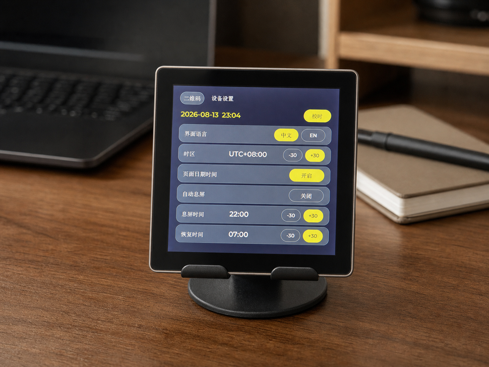
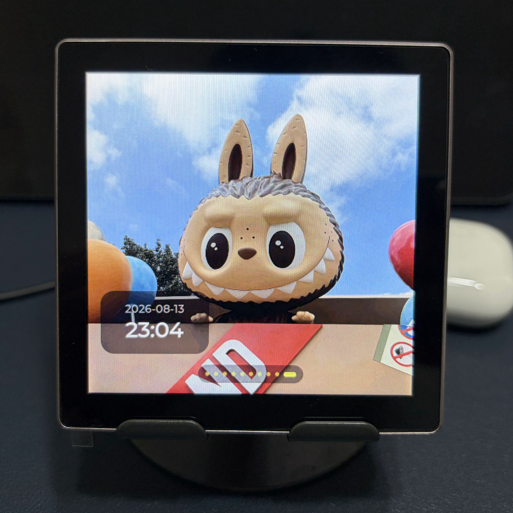

# ScreenDeck

[](https://github.com/mrjoechen/ScreenDeck/actions/workflows/pages.yml)

ScreenDeck turns the Guition / Jingcai ESP32-S3-4848S040 into a locally managed, swipeable 480×480 content display.

Flash from the browser (no desktop software): **https://mrjoechen.github.io/ScreenDeck/**

中文介绍与网页刷机台也在同一地址。

<p align="center">
  
  
</p>

## Included behavior

- First boot starts a password-protected access point and displays its Wi-Fi QR
  code. The captive portal at `http://192.168.4.1/` scans and saves Wi-Fi
  credentials in NVS.
- After joining the LAN, the QR controller page is shown by default only when
  no content pages exist.
- The web controller can add text pages, upload PNG/JPG/GIF pages, add pages
  straight off the TF card, reorder or delete pages, change brightness, and
  clear the saved Wi-Fi network.
- With content present, horizontal gestures and five-second automatic playback
  wrap through content pages only. A manual swipe restarts the timer.
- Pulling down from the top edge opens the controller QR page. After ten
  seconds without touch input, the display returns to the previous content
  page and resumes playback.
- The QR page links to an on-device settings screen whose actionable controls
  match the web Settings view: live 5–100 brightness, Chinese/English, manual or
  network time, the complete UTC-offset list (including UTC+05:45), date/time
  overlays, image-page weather, minute-precise scheduled sleep, and confirmed
  Wi-Fi clearing.
- Optional weather appears at the bottom-right of image pages. A background
  task locates the device from its public IP, reads current temperature,
  WMO weather code, and day/night state from Open-Meteo, then refreshes every
  30 minutes without blocking playback or the local controller.
- The on-device settings screen and web controller share the same persistent
  display preferences, so changes made from either surface stay in sync across
  restarts.
- When a scheduled screen-off window begins, the backlight fades smoothly to
  black over 600 ms. A double tap temporarily wakes it; the wake behaves like
  a phone's screen timeout, so every touch restarts it and the panel fades out
  again 30 seconds after the last one. Wake taps are consumed before they reach
  page or settings controls.
- Brightness and content configuration persist across restarts. Browser uploads
  use managed TF-card storage when available and fall back to the roughly 12 MB
  LittleFS partition; directly selected TF-card pages stay on the card.
- Settings commits keep the backlight lit. Only image uploads, which write
  hundreds of kilobytes, still gate it.

## Hardware target

- ESP32-S3 revision 0.2
- 16 MB DIO flash
- 8 MB OPI PSRAM
- ST7701 480×480 RGB display
- GT911 capacitive touch on GPIO 19/45
- Backlight PWM on GPIO 38 at 150 Hz. This driver cannot follow a fast
  carrier: at 20 kHz every duty below full scale collapsed the LED string, so
  the panel read as off for any brightness under 100 %.
- TF card on GPIO 48/47/41/42, sharing SCK and MOSI with the panel command bus

## Display architecture

The display path uses the ESP-IDF 5.5 stack end to end:

- `esp_lcd_panel_io_additions` sends the ST7701 initialization sequence over
  its 3-wire command interface.
- `esp_lcd_st7701` owns the 480×480 RGB panel and RGB DMA.
- `esp_lcd_touch_gt911` owns the I2C touch controller.
- `esp_lvgl_adapter` owns LVGL's tick, render worker, VSYNC callbacks, and
  framebuffer lifecycle in `TRIPLE_FULL` anti-tearing mode.
- Three full-screen RGB565 framebuffers live in OPI PSRAM. A 20-line internal
  SRAM bounce buffer isolates continuous RGB scanout from PSRAM stalls.

Arduino remains as an ESP-IDF compatibility component for the existing Wi-Fi,
web portal, LittleFS, and preference APIs; it no longer owns display, touch,
LVGL scheduling, or frame synchronization.

All LittleFS and NVS writes pause the LVGL worker. The RGB bounce-buffer
interrupt is IRAM-safe (`CONFIG_LCD_RGB_ISR_IRAM_SAFE`), so scanout survives
the cache being disabled during a flash write and only long writes still gate
the backlight. On-screen settings taps are coalesced into one commit 1.2 s after
the last change; brightness previews remain in RAM while dragging and enter
that save path only when the slider is released.

`components/esp_lvgl_adapter` is a pinned 0.6.3 tree with a PPA hang workaround.
Display, touch, and LVGL versions are locked in `src/idf_component.yml`.

## Build

The project uses a PlatformIO ESP-IDF/Arduino hybrid build pinned to ESP-IDF
5.5.2 and Arduino-ESP32 3.3.7.

Install [PlatformIO Core](https://platformio.org/install/cli), then from the
repository root:

```sh
export PATH="$HOME/.platformio/penv/bin:$PATH"
pio run
```

The compiled application is `.pio/build/esp32s3/firmware.bin`.

## Flash

USB upload is fixed at 115200 because some USB-to-serial links corrupt at
higher baud rates.

```sh
pio run --target upload
```

PlatformIO writes the bootloader, partition table, and application. The first
boot formats the new LittleFS content partition if needed.

For a blank device you can instead flash the merged factory image at address
`0x000000`. GitHub Pages serves the current factory image through ESP Web Tools;
locally you can create the same file with:

```sh
pio run
./tools/merge-web-firmware.sh
```

## First-use flow

1. Power on the display.
2. Scan the Wi-Fi QR code shown on screen. The AP password is encoded in the QR
   code; it is also `screen1234`.
3. If the phone does not open the captive portal automatically, visit
   `http://192.168.4.1/`.
4. Pick the target Wi-Fi and save its password.
5. After restart, scan the new controller QR code or type the displayed IP on a
   computer connected to the same LAN. mDNS is `http://screendeck.local/`.

## Landing page and GitHub Pages

The static site under `site/` mirrors the on-device controller's visual system,
documents the current firmware, and integrates ESP Web Tools 10.4.0 for USB Web
Serial flashing. It has no frontend build step and uses relative URLs so it can
be published as a GitHub Pages project site.

Preview it through HTTP rather than opening `index.html` directly:

```sh
python3 -m http.server 4173 --directory site
```

Then open `http://localhost:4173/`. A local preview needs a current merged image
at:

```text
site/firmware/esp32-s3-4848s040/screendeck-esp32s3-4848s040-factory.bin
```

That file is gitignored. Firmware shown on the landing page comes from GitHub
Releases after you push a version tag:

```sh
git tag v1.0.0
git push origin v1.0.0
```

`.github/workflows/release.yml` then:

1. Compiles the firmware with `SCREENDECK_VERSION` (the tag) and
   `SCREENDECK_BUILD_TIME` (UTC timestamp) baked in.
2. Merges a factory image and publishes GitHub Release assets.
3. Deploys `site/` so the browser installer flashes that tagged image.
4. Writes version, channel, and update date into `site/firmware/release.json`,
   which the landing page reads for the 版本 / 更新 fields.

Pushes to `main` still refresh the Pages site. If a Release already exists,
that workflow attaches the latest factory image instead of replacing it with a
development build. Serial output and `GET /api/status` also report
`firmwareVersion` and `firmwareBuildTime`.

In the GitHub repository: **Settings → Pages → Source → GitHub Actions**.
The first successful workflow run publishes
https://mrjoechen.github.io/ScreenDeck/

The device registry is `site/firmware/devices.json`. Each future board must use
its own directory and ESP Web Tools manifest; chipset detection can distinguish
ESP32 families, but it cannot distinguish two incompatible display boards that
both use ESP32-S3.

## TF card

The card slot shares its clock and data lines with the ST7701 command bus
(SCK GPIO 48, MOSI GPIO 47) and adds MISO GPIO 41 and CS GPIO 42. The card is
therefore mounted only after the panel initialization sequence has finished;
the display controller's chip select stays high afterwards, so card traffic
never reaches it.

- The ST7701 command IO releases the shared GPIO 48/47 lines after panel
  initialization, then the card is probed at 20, 10, and 4 MHz. A missing card,
  a missing slot, or an unreadable filesystem is not an error.
- Status requests retry an absent card at a bounded rate, so a card inserted
  after boot is detected without restarting. The web settings and the device's
  **System** settings show mount state, used/total capacity, and negotiated SPI
  clock; their scan controls force a clean remount.
- FAT16 and FAT32 are supported. An exFAT or NTFS card is detected without being
  modified and is reported as unsupported in both interfaces; an unknown or
  damaged filesystem is reported as unreadable. The firmware never formats a
  card automatically.
- `04 / TF card` in the web controller lists playable files up to three
  directories deep only after **Browse card files** is pressed, then adds any
  selected file as a page. The controller never scans this list at startup and
  does not download SD-backed playlist media for thumbnails. Files are played
  in place, never copied, and deleting such a page never deletes the file.
- Browser uploads use the card as managed storage when it is mounted. Processed
  static images are published under `/ScreenDeck/media/`, GIF animations under
  `/ScreenDeck/animations/`, and in-progress writes under `/ScreenDeck/temp/`.
  Each upload is fully written and size-checked before its `.part` file is
  renamed into the playback folder. If no usable card is present, the upload
  falls back to LittleFS.
- Deleting the last page that references a managed upload also deletes that
  upload. Files manually copied elsewhere on the card remain user-owned and are
  never deleted by ScreenDeck.
- PNG, JPG, GIF, and `.rgb565` are listed. LVGL's split-JPEG decoder keys on a
  `.jpg` tail, so `.jpeg` files must be renamed.
- Pages that point at the card survive an unplugged card: they show a "reinsert
  the card" message and recover after **Rescan card**.

## Image and text notes

- Select and upload one or more PNG/JPG files through the web controller. The
  browser previews the selected files, then center-crops each one to 480×480
  and converts it to the panel's RGB565 format before uploading sequentially.
  Playback therefore reads predictable, display-ready files from the managed
  media folder instead of decoding arbitrary source image dimensions.
- The firmware keeps the current and adjacent images in a three-slot PSRAM
  cache. Existing PNG pages remain compatible and are decoded into this cache
  once, rather than on every swipe.
- RGB565 image pages use about 450 KB each and fill the screen without
  stretching or letterboxing.
- GIF pages are uploaded untouched and played by LVGL's decoder at their own
  size, centered, up to 480 x 480. A GIF holds roughly four bytes of PSRAM per
  pixel while it is on screen, so only one plays at a time and animated pages
  get a 15-second dwell instead of the usual five.
- The RGB panel and LVGL share three driver-owned full-screen PSRAM
  framebuffers. Espressif's adapter publishes only completed frames at the RGB
  driver's frame boundary, avoiding partial redraws, stale-frame replay, and
  backlight blanking during page switches.
- The firmware includes LVGL's common SimSun CJK glyph set and an embedded
  monochrome Noto Emoji font. Common Chinese and standard emoji render directly;
  emoji follow the selected text color. Complex ZWJ, flag, and skin-tone
  sequences can fall back to their individual symbols, and uncommon Chinese
  glyphs outside the embedded subset may appear as placeholders.
- The web controller has no login and is intended for a trusted local network.

## Repository layout

| Path | Purpose |
| --- | --- |
| `src/`, `include/` | ScreenDeck firmware |
| `components/esp_lvgl_adapter/` | Pinned LVGL adapter with local patch |
| `site/` | GitHub Pages landing page and web installer |
| `tests/` | Release guards (no hardware required) |
| `tools/` | Embed-file helper and factory-image merge script |
| `.github/workflows/pages.yml` | Build firmware and deploy Pages |

## License

MIT. See [LICENSE](LICENSE).

Third-party components keep their own licenses, including Espressif's
Apache-2.0 LVGL adapter, LVGL, and the [SIL Open Font License](docs/NotoEmoji-OFL.txt)
for the embedded Noto Emoji subset.
