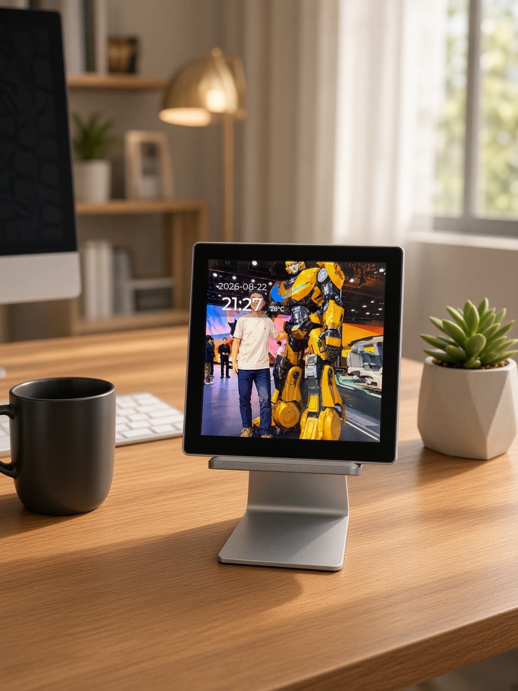
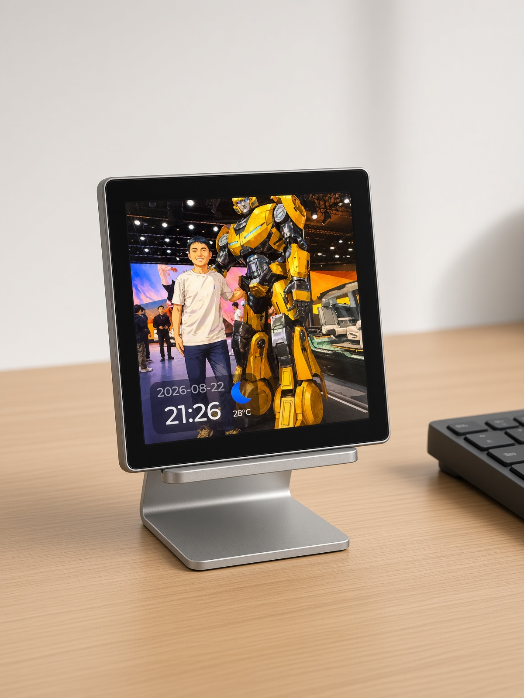
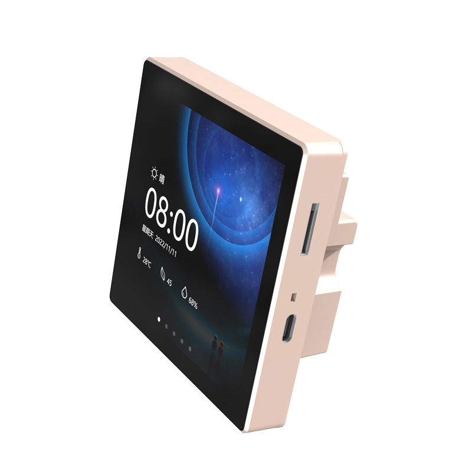
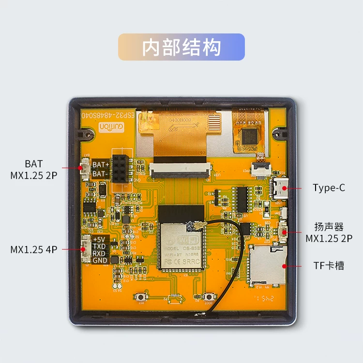

# ScreenDeck

[English](README.md) | 中文

ScreenDeck 把Guition / Jingcai ESP32-S3-4848S040 变成可在局域网管理、左右滑动切换的 480×480 内容屏。

无需安装桌面软件，数据线连接设备，直接用浏览器刷入： **https://mrjoechen.github.io/ScreenDeck/**

  
  

  
  

## 功能

- **本地优先。** 内容和设置都保存在设备上，没有云账号。网页控制器面向受信任的局域网，不设登录。
- **首次开机配网。** 屏幕会开启带密码的热点并显示二维码。扫码，或打开 `http://192.168.4.1/`，即可保存家里的 Wi-Fi。热点密码写在二维码里，也是 `screen1234`。
- **网页控制器。** 接入局域网后，用屏幕上的地址或 `http://screendeck.local/` 管理设备：添加文字页、上传 PNG/JPG/GIF、从 TF 卡加入文件、调整顺序或删除、调节亮度、清除已保存的 Wi-Fi。
- **播放。** 左右滑动与五秒自动播放只循环内容页；手动滑动会重开计时。GIF 动图停留 15 秒。从顶部下拉打开控制器二维码页；十秒无触摸后回到播放。
- **设备设置。** 与网页设置一致：5–100% 亮度、淡入淡出或水平滑动的页面动画、中/英文、手动或网络校时、完整 UTC 时区列表（含 UTC+05:45）、日期时间叠层、图片页天气、精确到分钟的定时息屏，以及需确认的清除 Wi-Fi。两边改的设置会同步，重启后仍在。
- **天气。** 可在图片页显示天气。后台根据公网 IP 定位，从 Open-Meteo 读取气温、WMO 天气代码和昼夜状态，每 30 分钟刷新一次。
- **定时息屏。** 进入息屏时段后，背光约 600 ms 淡出。双击唤醒，行为类似手机：每次触摸都会重新计时，停手 30 秒后再淡出。
- **存储。** 有可用 TF 卡时，浏览器上传写到卡上；否则回退到约 12 MB 的机身 LittleFS。从卡上直接选中的文件仍留在卡上。

## 硬件

当前只支持一块板：**Guition / Jingcai ESP32-S3-4848S040**。

- ESP32-S3 · 16 MB Flash · 8 MB PSRAM
- ST7701 480×480 RGB 屏 · GT911 电容触控
- USB 刷机，TF 卡槽存放媒体

## 开始使用

1. 在 **https://mrjoechen.github.io/ScreenDeck/** 刷入固件；若要从源码编译，见 [构建与刷写](docs/build-and-flash.md)。
2. 开机，扫描屏幕上的 Wi-Fi 二维码。
3. 若手机没有自动打开门户，访问 `http://192.168.4.1/`。
4. 选择目标 Wi-Fi 并保存密码。
5. 重启后，扫描控制器二维码，或在同一局域网的电脑上打开屏幕显示的 IP。

只有还没有任何内容页时，开机后才会默认停在控制器二维码页。

## 内容

- 通过网页一次选择一张或多张 PNG/JPG。浏览器会预览、居中裁切为 480×480，并转成屏的 RGB565 再上传。
- 最多 16 个内容页。RGB565 图片铺满屏幕，不拉伸、不留边。
- 不超过 2 MB、不超过 480×480 的 GIF 保留动画，按原尺寸居中播放。同一时间只播放一张 GIF。
- 文字页可直接显示常用中文和常见 emoji。复杂的 ZWJ、旗帜、肤色序列可能拆成单个符号；字库以外的生僻字可能显示为占位符。

## TF 卡

- 支持 FAT16 和 FAT32。exFAT、NTFS 会被识别并提示不受支持。固件不会自行格式化卡片。
- 可浏览最多三层目录中的 PNG、JPG（`.jpg`，不是 `.jpeg`）、GIF 和 `.rgb565`，再把文件加为页面。播放时直接读卡上的文件；删除该页不会删除文件。
- 浏览器上传写入 `/ScreenDeck/media/`（静图）、`/ScreenDeck/animations/`（GIF）和 `/ScreenDeck/temp/`（进行中的写入）。删除最后一个引用某次托管上传的页面时，也会删掉那份上传。你自己拷到卡上其他位置的文件仍归你。
- 指向 TF 卡的页面在拔卡后仍保留：会提示重新插卡，**重新扫描** 后恢复。开机后再插卡，无需重启即可识别。

## 许可证

MIT，见 [LICENSE](LICENSE)。

第三方组件保留各自许可证，包括 Espressif Apache-2.0 的 LVGL 适配层、LVGL，以及嵌入 Noto Emoji 子集的 [SIL Open Font License](docs/NotoEmoji-OFL.txt)。

构建、刷写、落地页和 GitHub Release 说明在 [docs/](docs/README.md)。
